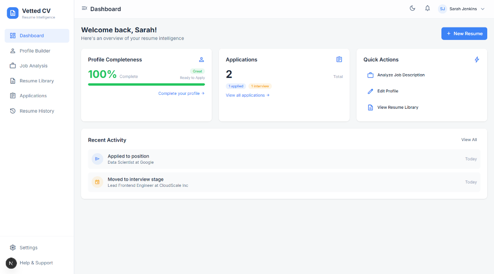
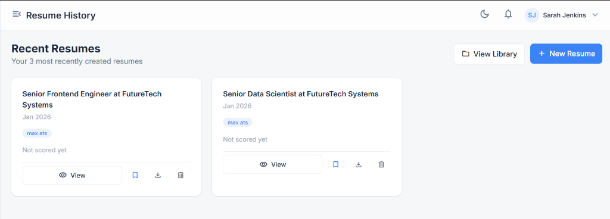
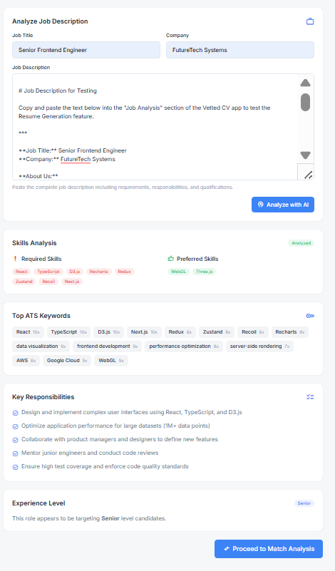
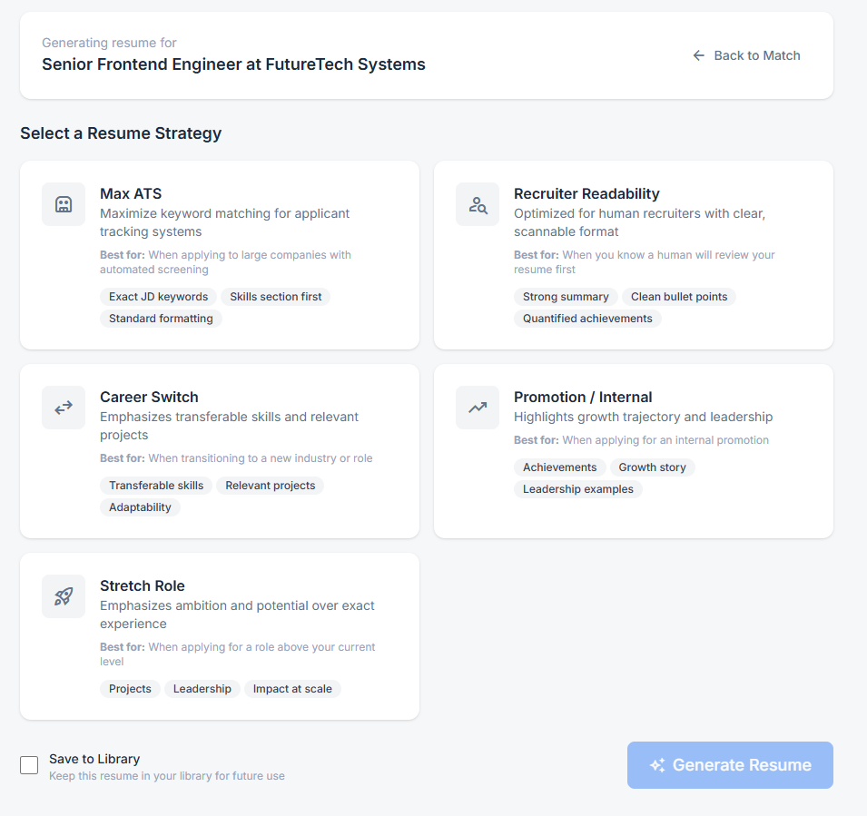
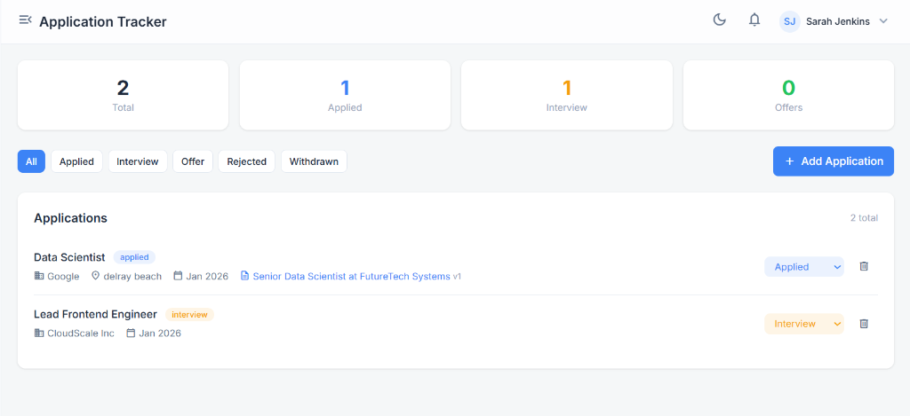

# Vetted CV - The Intelligent Career Companion



**Vetted CV** is an AI-powered workspace designed to help job seekers tailor their resumes, track applications, and land their dream jobs. It replaces scattered spreadsheets and generic resume editors with a unified, intelligent workflow.

## 🚀 Why I Built This

Job hunting is a fragmented process. Candidates juggle tailored resumes, application statuses, and job descriptions across multiple platforms. I built **Vetted CV** to solve this by bringing everything into one streamlined ecosystem:

*   **Problem**: Candidates send generic resumes because tailoring is time-consuming.
*   **Solution**: "One-Click" AI tailoring that re-writes resumes based on specific job descriptions (JD).
*   **Problem**: Applicant Tracking Systems (ATS) filter out qualified candidates.
*   **Solution**: Real-time ATS keyword analysis and scoring against target JDs.

## ✨ Key Features

- **🤖 AI-Powered Resume Tailoring**: Instantly re-write bullet points to match job requirements using OpenAI, Claude, or Gemini.
- **📊 Smart Job Analysis**: Paste a JD to get a breakdown of required skills, keywords, and a "Match Score".
- **🏆 Gamified Profile Building**: A LinkedIn-style profile builder with a completeness score to ensure you never miss key details.
- **📋 Kanban Application Tracker**: Visualize your pipeline from "Applied" to "Offer".
- **📝 Resume Library**: Version control for your resumes - keep track of which version you sent to which company.

## 📸 Visual Walkthrough

### 1. Job Analysis & Matching
Analyze a job description to understand exactly what the company is looking for.


### 2. Strategy Selection
Choose how you want to position yourself: **Max ATS** (keyword heavy) or **Recruiter Readability** (human-focused).


### 3. Detailed Match Analysis
See exactly where your profile hits the mark and where you have gaps.


### 4. Application Tracking
Manage your job hunt like a sales pipeline.


## 🛠️ Tech Stack

**Frontend**
*   **Next.js 14**: App Router for server-side rendering and performance.
*   **TypeScript**: Full-stack type safety.
*   **Tailwind CSS + ShadCN UI**: Rapid, accessible, and beautiful UI development.
*   **Recharts**: Data visualization for job match scoring.

**Backend**
*   **Node.js**: Robust runtime.
*   **PostgreSQL**: Relational data model for complex user/application relationships.
*   **Prisma ORM**: Type-safe database access.

**AI & Infrastructure**
*   **Multiple LLM Support**: Pluggable architecture supporting OpenAI, Anthropic, and Google Gemini.
*   **Vercel AI SDK**: Streaming responses for a responsive user experience.

## 🚀 Getting Started

### Prerequisites
- Node.js 18+
- PostgreSQL (Local or Cloud)

### Installation

1.  **Clone the repository**
    ```bash
    git clone https://github.com/yourusername/vetted-cv.git
    cd vetted-cv
    ```

2.  **Install dependencies**
    ```bash
    # Root dependencies
    npm install
    
    # Install frontend & backend dependencies
    cd frontend && npm install
    cd ../backend && npm install
    ```

3.  **Configure Environment**
    Copy `.env.example` to `.env` and fill in your keys.
    ```bash
    cp .env.example .env
    ```

4.  **Database Setup**
    ```bash
    # Run migrations
    npx prisma migrate dev
    
    # Seed initial data (optional)
    npm run seed
    ```

5.  **Run Development Server**
    ```bash
    npm run dev
    ```
    Open [http://localhost:3000](http://localhost:3000) to view the app.

## 🤝 Contributing

Contributions are welcome! Please feel free to submit a Pull Request.

## 📄 License

This project is licensed under the MIT License - see the [LICENSE](LICENSE) file for details.
